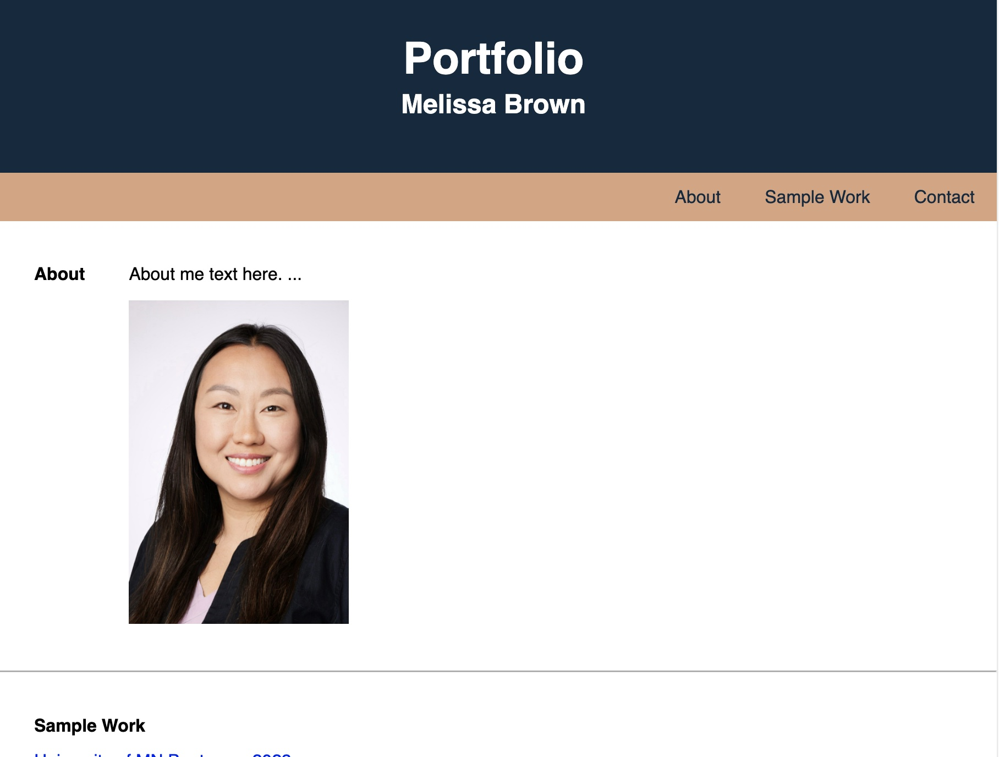
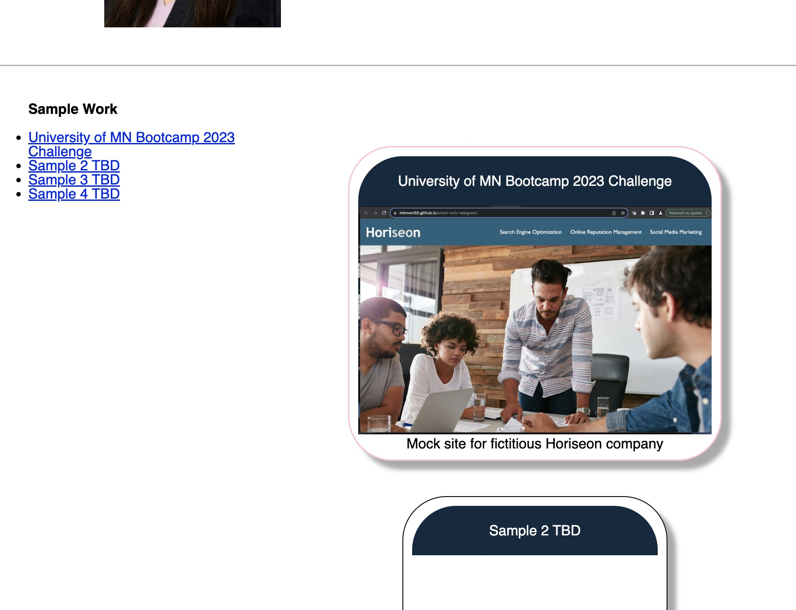
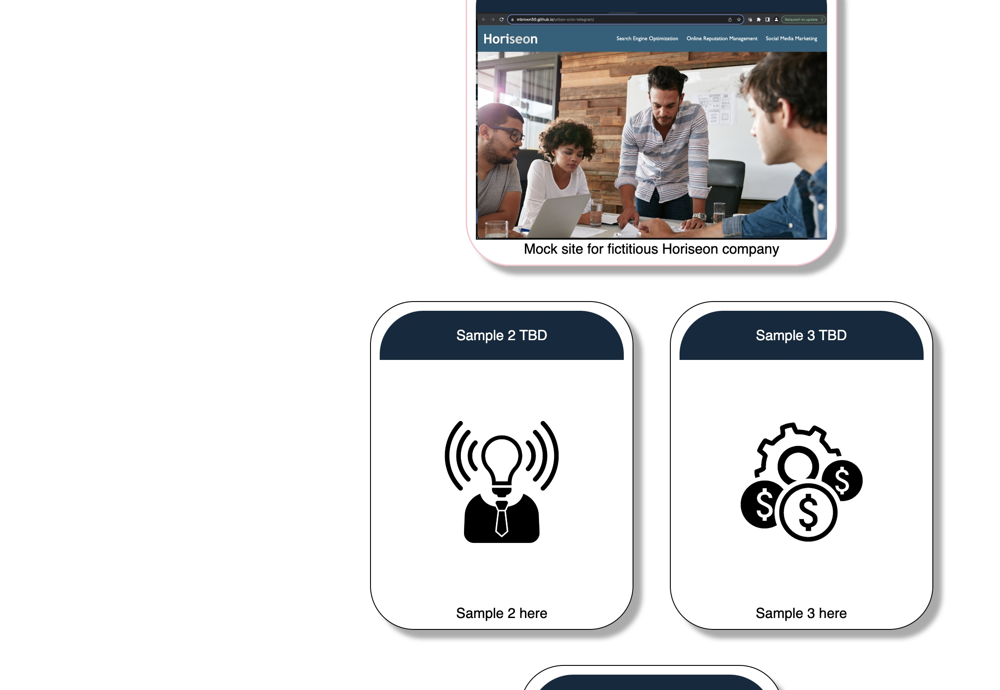
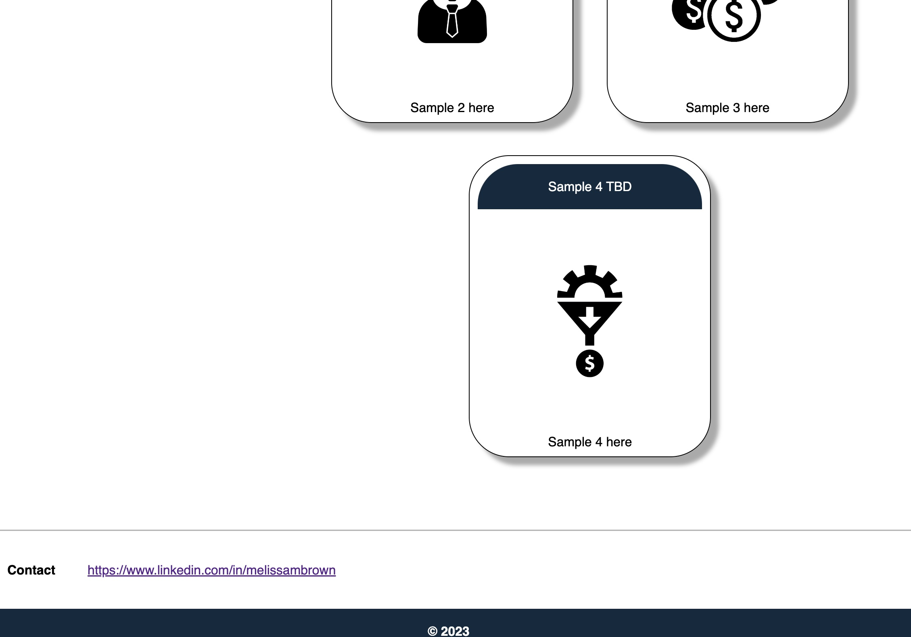

# Module2-Challenge-Portfolio
2023 UMN Bootcamp Module2 Challenge Portfolio

## Description

User Story:
AS AN employer I WANT to view a potential employee's deployed portfolio of work samples SO THAT I can review samples of their work and assess whether they're a good candidate for an open position

GitPages deployed link:
https://mbrown50.github.io/Module2-Challenge-Portfolio/

GitHub Repo:
https://github.com/mbrown50/Module2-Challenge-Portfolio/

## Installation

N/A

## Usage

N/A

## License

Please refer to the LICENSE in the repo.
MIT License
